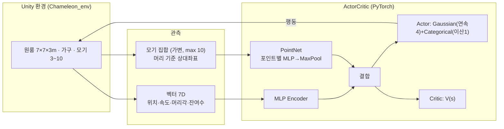

# 🦎 Chameleon Agent

> Unity 물리 가상환경에서 **모기를 자율 포획하는 소형 홈 로봇**을 강화학습으로 훈련하는 프로젝트.
> 표준 `mlagents-learn` 을 쓰지 않고 **PyTorch 로 PPO 학습 루프를 직접 구현**했다.

`Unity 6` · `ML-Agents 4.0.3` · `PyTorch` · `Custom PPO` · `PointNet` · `Hybrid Action`

---

## 🎬 데모

<!-- TODO: 학습 장면 GIF / 환경 스크린샷 추가 예정 -->
> _데모 영상 / 스크린샷 추가 예정._

---

## 문제 & 동기

모기 퇴치는 일상적 문제지만 기존 방식(스프레이·모기향)은 화학적 부작용이 있고, 물리적 포획은 자동화가 어렵다.
이 프로젝트는 그 첫 단계로 **가상환경에서 모기를 자율 포획하는 RL 에이전트**를 만든다. 가상에서 검증된 정책을 **추후 실물 로봇으로 이식**하는 것이 최종 목표이며, 그래서 게임적 단순화를 피하고 **현실 물리(중력·충돌·무게)** 를 그대로 반영한다.

제약은 둘:
1. 방 안 **모든 모기 포획**
2. 그 과정에서 **가구를 파손하지 않을 것** — 파손 시 즉시 실패 종료

---

## ✨ 핵심 특징

- **🛠 커스텀 PPO 직접 구현** — 블랙박스 `mlagents-learn` 대신 `mlagents-envs` + PyTorch 로 rollout 수집 · GAE · clipped update · 체크포인트까지 학습 루프 전체를 직접 작성 (`src/`). 모델·업데이트 로직 완전 제어.
- **🎯 Hybrid Action Space** — 연속 4(전후진·차체 yaw·머리 yaw·머리 pitch) + 이산 1(대기/혀 발사)을 한 정책에서 동시에 출력 (Gaussian + Categorical).
- **🦟 PointNet 기반 가변 관측** — 시야에 들어온 모기 수가 매 스텝 달라지는 문제를, 모기 집합 `{(x,y,z,vx,vy,vz)}` 을 PointNet(포인트별 MLP → max pooling)으로 인코딩해 **고정 크기 특징**으로 변환.
- **🌍 현실 물리 반영** — 가구마다 실제 무게(kg)·파손 임계를 부여. "가벼움/무거움" 태그 없이 Unity 강체 물리가 끌림·파손을 자동 결정. 실물 이식을 전제로 한 설계.
- **👁 부분 관측(POMDP) 설정** — 머리 카메라 FOV ~90°, occlusion(가구·벽 뒤 모기 안 보임) 반영 → 에이전트가 **둘러보는 행동**을 학습해야 함.

---

## 🧠 시스템 구조



학습은 **PPO**(Clipped Surrogate + GAE)로 진행. On-policy 의 보수적 업데이트가 "가구 파손 회피" 제약에 유리하다.

| 모듈 | 역할 |
|---|---|
| `src/train.py` | 학습 루프 (rollout 수집 → PPO 업데이트 → 로깅/저장) |
| `src/network.py` | ActorCritic + PointNet + 벡터 인코더 |
| `src/ppo.py` | PPO 업데이트 (clip · value · entropy) |
| `src/buffer.py` | RolloutBuffer + GAE |

---

## 📐 설계 요약

| 구분 | 내용 |
|---|---|
| **환경** | 고정 원룸 7m×7m×3m, 가구 고정 배치, Unity Physics |
| **에이전트** | ~30cm 홈 로봇. 탱크형 차동 구동 + 머리 yaw/pitch 독립 회전. 카멜레온 혀(사이클 ~0.3s) |
| **관측** | ① 벡터 7D(자기 상태) ② PointNet(시야+occlusion 통과 모기 집합) |
| **행동** | 연속 4 + 이산 1 (Hybrid) |
| **보상** | 포획(+)·미스(−)·시간(−)·접근(+, shaping)·파손(−,종료)·전멸 성공(+,종료) |
| **종료** | 전부 포획(성공) / 가구 파손(실패) / MaxStep(중립=truncated) |
| **알고리즘** | 커스텀 PPO, γ=0.99 · λ=0.95 · clip=0.2 · lr=3e-4 |

> 📖 전체 설계 확정본은 **[`docs/RL_Design.md`](docs/RL_Design.md)** 참조 (단일 진실 소스).

---

## 🚀 빠른 시작

```powershell
# 1. Python 3.10 환경 (mlagents-envs 1.1.0 은 3.11+ 미지원)
conda activate unity_rl_310
pip install -r requirements.txt

# 2. Unity 빌드 → Builds/MainEnv/Chameleon_env.exe   (가이드: docs/unity_guide/)

# 3. 학습 (빌드 + 헤드리스 + 배속)
python scripts/run_train.py env_path=Builds/MainEnv/Chameleon_env.exe no_graphics=true time_scale=20

# 4. 모니터링
tensorboard --logdir results/run_01/tb     # → http://localhost:6006
```

상세 실행법(에디터 연결 모드 · 설정 오버라이드 · 트러블슈팅)은 **[`docs/train_guide.md`](docs/train_guide.md)**.

---

## 📊 결과

<!-- TODO: 학습 곡선(ep_reward_mean), 포획 성공률, Ablation(E1~E3) 결과 추가 -->
> _학습 진행 중. 학습 곡선 · 포획 성공률 · Ablation(보상 shaping / PointNet / 커리큘럼 유무) 결과 추가 예정._

평가 지표: 에피소드 누적 보상 · 모기 포획 성공률 · 물품 파손 횟수 · 허공 공격 비율 · 종료 분포(성공/실패/시간초과).

---

## 🛠 기술 스택

`Python 3.10` · `PyTorch` · `Unity 6 (6000.x)` · `ML-Agents 4.0.3 / mlagents-envs 1.1.0` · `Hydra` · `TensorBoard`

---

## 📂 문서

| 문서 | 내용 |
|---|---|
| [`docs/RL_Design.md`](docs/RL_Design.md) | 설계 단일 진실 소스 — 환경/MDP/알고리즘/실험 |
| [`docs/train_guide.md`](docs/train_guide.md) | 학습 실행 가이드 |
| [`docs/unity_guide/`](docs/unity_guide/README.md) | Unity 씬 구성~빌드 click-by-click (U0–U10) |

---

## 현재 상태

- ✅ 커스텀 PPO 트레이너 구현 + Unity 연동(Behavior `Chameleon`) 동작 확인
- ✅ Windows 스탠드얼론 빌드 + 헤드리스 배속 학습 파이프라인 가동
- 🔜 커리큘럼 단계별 학습 · Ablation · 결과/데모 수집
