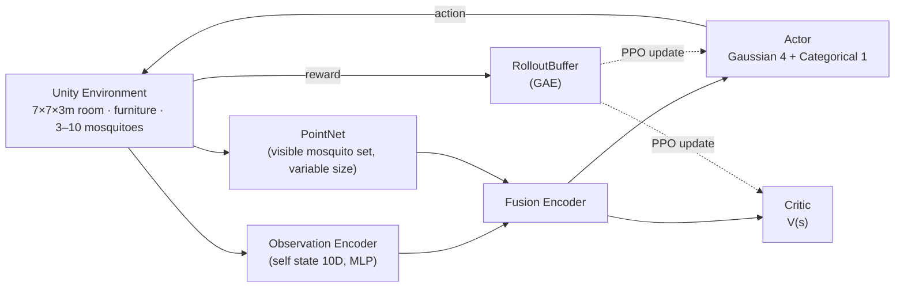

# Chameleon Agent

> Training a **small home robot that autonomously catches mosquitoes** with reinforcement learning, in a physics-accurate Unity environment.
> The PPO training loop is **implemented from scratch in PyTorch** instead of using the standard `mlagents-learn` trainer.

[한국어 README](README_Ko.md)


---

## Demo


In a 7m×7m studio room with 3–10 mosquitoes flying around, a 30cm chameleon robot drives about, turns its head to spot mosquitoes, and fires a 2.5m tongue to catch them. The policy — catch every mosquito in the room without breaking any furniture — was trained with a from-scratch PyTorch PPO implementation and a catch-rate-based curriculum. Since the end goal is transferring the validated policy to a real robot, the environment keeps realistic physics (gravity, collisions, mass) with no game-style simplifications.

---

## Table of Contents

- [Getting Started](#getting-started)
  - [Requirements](#1-requirements)
  - [Installation](#2-installation)
  - [Building the Unity Environment](#3-building-the-unity-environment)
  - [Training](#4-training)
  - [Resuming from a Checkpoint](#5-resuming-from-a-checkpoint)
  - [Monitoring](#6-monitoring)
  - [Evaluating a Trained Policy](#7-evaluating-a-trained-policy)
  - [Key Settings](#key-settings-configdefaultyaml)
- [System Architecture](#system-architecture)
  - [Project Structure](#project-structure)
- [Summary](#summary)

---

## Getting Started

### 1. Requirements

- **Python 3.10.x** — `mlagents-envs 1.1.0` does not support 3.11+
- **Unity 6 (6000.x)** with the ML-Agents 4.0.3 package — only needed to rebuild the environment
- GPU optional (CUDA is used automatically when available)

### 2. Installation

```powershell
conda create -n unity_rl_310 python=3.10 -y
conda activate unity_rl_310
pip install -r requirements.txt
```

### 3. Building the Unity Environment

Open `Chameleon_env/` with Unity 6 and build the `MainEnv` scene as a Windows Standalone player.
The recommended output path is `Builds/MainEnv/Chameleon_env.exe`, matching the config default (use `env_path=` at runtime for a different path).

### 4. Training

```powershell
# Default run — uses config/default.yaml (headless, 20x time scale)
python scripts/train.py

# Override settings (Hydra) — e.g. watch the screen at 10x speed
python scripts/train.py no_graphics=false time_scale=10

# Connect to the Unity Editor instead of a build — run this, then press Play in the editor
python scripts/train.py env_path=null
```

### 5. Resuming from a Checkpoint

```powershell
# Point to a saved model and the curriculum stage it had reached
python scripts/resume_train.py resume_path=results/run6/model_600.pt start_stage=5
```

### 6. Monitoring

```powershell
mlflow ui    # → http://localhost:5000 , experiment: chameleon-rl
```

- Tracked metrics: episode reward, catch rate (curriculum promotion criterion), losses, and **fire entropy / fire attempt rate** (early warnings for firing-policy pathologies)
- Model checkpoints are saved periodically to `save_dir` (see `save_interval`)

### 7. Evaluating a Trained Policy

> **Trained model download:** the final trained checkpoint ships with this repo — **[`models/chameleon_ppo_final.pt`](models/chameleon_ppo_final.pt)** (225KB). Pass it as `resume_path=models/chameleon_ppo_final.pt` to any command below.

```powershell
# Deterministic mode (no exploration noise) — catch rate, full-clear rate, per-shot accuracy
python scripts/evaluate.py resume_path=results/run6/model_900.pt eval_stage=5 eval_episodes=50

# Performance under the deployment rule (mission ends after 25s without any mosquito detection)
python scripts/evaluate_virtual_stop.py resume_path=results/run6/model_900.pt eval_stage=5 eval_episodes=50

# Demo: watch live in the editor (run this, then press Play in the Unity Editor)
python scripts/evaluate.py resume_path=results/run6/model_900.pt eval_stage=5 env_path=null no_graphics=false time_scale=1
```

### Key Settings (`config/default.yaml`)

| Key | Default | Meaning |
|---|---|---|
| `env_path` | `Builds/MainEnv/Chameleon_env.exe` | Build path. `null` connects to the editor |
| `time_scale` | 20 | Simulation speed multiplier |
| `no_graphics` | true | Headless execution |
| `max_iterations` | 5000 | Number of training iterations |
| `resume_path` / `start_stage` | null / 1 | Checkpoint and curriculum stage for resuming |
| `gamma` / `lam` / `clip_eps` | 0.995 / 0.95 / 0.2 | Core PPO hyperparameters |

---

## System Architecture



Training uses **PPO** (Clipped Surrogate + GAE). The conservative on-policy updates suit the "never break furniture" constraint.

### Project Structure

```
chameleon-agent/
├─ Chameleon_env/          # Unity project (scene · agent · mosquito · furniture scripts)
├─ config/default.yaml     # Run & hyperparameter settings (Hydra)
├─ scripts/
│   ├─ train.py            # Training entry point
│   ├─ resume_train.py     # Resume from checkpoint
│   ├─ evaluate.py         # Deterministic evaluation (catch / clear / per-shot accuracy)
│   └─ evaluate_virtual_stop.py  # Evaluation under the deployment stop rule
├─ src/
│   ├─ network.py          # ActorCritic (MLP + PointNet)
│   ├─ ppo.py              # Clipped update · separated entropy
│   ├─ buffer.py           # RolloutBuffer + GAE
│   ├─ communicator.py     # Unity ↔ Python data exchange
│   ├─ curriculum.py       # Catch-rate-based 6-stage curriculum
│   ├─ trainer.py          # Collect → update loop
│   └─ logger.py           # MLflow logging
├─ docs/objective_f.md     # Deep dive into the objective function & training cycle
└─ report.md               # Project report (background · design · experiments)
```

---

## Summary

| Item | Description |
|---|---|
| Goal | Learn an autonomous robot policy that catches every mosquito in the room without breaking furniture |
| Environment | Unity 6 · 7×7×3m studio room · realistic physics (gravity, collision, mass) · partial observability (FOV 90°, occlusion) |
| Observation | 10D self-state vector + variable-size mosquito set encoded with PointNet |
| Action | Hybrid — 4 continuous (drive, body rotation, head yaw/pitch) + 1 discrete (tongue fire) |
| Algorithm | From-scratch PyTorch PPO — GAE · separated continuous/discrete entropy · catch-rate-based 6-stage curriculum |
| Experiment tracking | MLflow — reward · catch rate · fire entropy · fire attempt rate |
| Result | Reached the final stage (3–10 mosquitoes) — catch rate 0.83 (120s limit) / 0.64 (deployment rule: stop after 25s of no detection) |

The long-term aim of this project is to transfer the simulation-validated policy onto a small physical robot.
