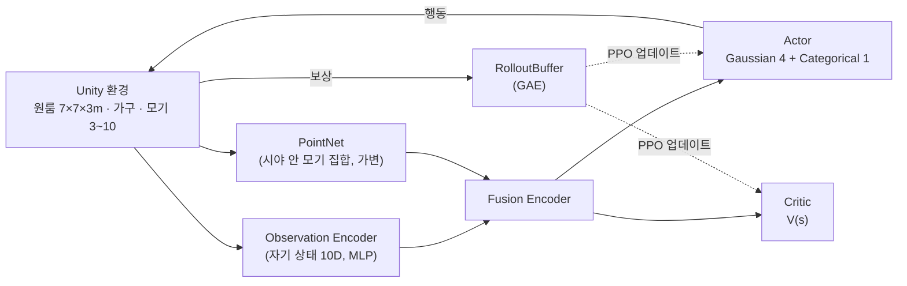

# Chameleon Agent

> Unity 물리 가상환경에서 **모기를 자율 포획하는 소형 홈 로봇**을 강화학습으로 훈련하는 프로젝트.
> 표준 `mlagents-learn` 을 쓰지 않고 **PyTorch 로 PPO 학습 루프를 직접 구현**했다.


---

## 데모


7m×7m 원룸에 모기 3~10마리가 날아다니고, 약 30cm 크기의 카멜레온 로봇이 돌아다니며 머리를 돌려 모기를 찾아 사거리 2.5m의 혀를 발사해 잡는다. 가구를 파손하지 않으면서 방 안의 모든 모기를 포획하는 정책을 PyTorch 로 직접 구현한 PPO 와 포획률 기반 커리큘럼으로 학습시켰다. 가상에서 검증한 정책을 실물 로봇으로 이식하는 것이 최종 목표라서, 게임적 단순화 없이 현실 물리(중력·충돌·무게)를 그대로 반영했다.

---

## 목차

- [시작하기](#시작하기)
  - [요구 사항](#1-요구-사항)
  - [설치](#2-설치)
  - [Unity 환경 빌드](#3-unity-환경-빌드)
  - [학습 실행](#4-학습-실행)
  - [체크포인트에서 재개](#5-체크포인트에서-재개)
  - [학습 모니터링](#6-학습-모니터링)
  - [학습된 정책 평가](#7-학습된-정책-평가)
  - [주요 설정](#주요-설정-configdefaultyaml)
- [시스템 구조](#시스템-구조)
  - [프로젝트 구조](#프로젝트-구조)
- [Summary](#summary)


---

## 시작하기

### 1. 요구 사항

- **Python 3.10.x** — `mlagents-envs 1.1.0` 이 3.11+ 를 지원하지 않음
- **Unity 6 (6000.x)** + ML-Agents 4.0.3 패키지 — 빌드를 새로 만들 때만 필요
- GPU 선택 사항 (CUDA 가능 시 자동 사용)

### 2. 설치

```powershell
conda create -n unity_rl_310 python=3.10 -y
conda activate unity_rl_310
pip install -r requirements.txt
```

### 3. Unity 환경 빌드

`Chameleon_env/` 를 Unity 6 으로 열고 `MainEnv` 씬을 Windows Standalone 으로 빌드한다.
출력 경로는 설정 기본값에 맞춰 `Builds/MainEnv/Chameleon_env.exe` 권장 (다른 경로면 실행 시 `env_path=` 로 지정).

### 4. 학습 실행

```powershell
# 기본 실행 — config/default.yaml 의 설정 사용 (헤드리스 + 20배속)
python scripts/train.py

# 설정 오버라이드 (Hydra) — 예: 화면 보면서 10배속
python scripts/train.py no_graphics=false time_scale=10

# 빌드 대신 Unity 에디터에 연결 — 실행 후 에디터에서 Play 누르면 접속됨
python scripts/train.py env_path=null
```

### 5. 체크포인트에서 재개

```powershell
# 저장된 모델과 도달했던 커리큘럼 단계를 지정
python scripts/resume_train.py resume_path=results/run6/model_600.pt start_stage=5
```

### 6. 학습 모니터링

```powershell
mlflow ui    # → http://localhost:5000 , experiment: chameleon-rl
```

- 추적 지표: 에피소드 보상 · 포획률(커리큘럼 승급 기준) · 손실 · **발사 엔트로피 / 발사 시도율** (발사 정책 이상 조기 경보)
- 모델 체크포인트는 `save_dir` 경로에 주기 저장 (`save_interval` 설정)

### 7. 학습된 정책 평가

```powershell
# 결정론 모드(탐색 노이즈 제거)로 포획률 · 전멸률 · 발당 명중률 집계
python scripts/evaluate.py resume_path=results/run6/model_900.pt eval_stage=5 eval_episodes=50

# 배포 규칙(모기 무감지 25초 → 임무 종료 가정) 기준 성능 측정
python scripts/evaluate_virtual_stop.py resume_path=results/run6/model_900.pt eval_stage=5 eval_episodes=50

# 데모: 에디터 화면으로 실시간 관찰 (실행 후 Unity 에디터에서 Play)
python scripts/evaluate.py resume_path=results/run6/model_900.pt eval_stage=5 env_path=null no_graphics=false time_scale=1
```

### 주요 설정 (`config/default.yaml`)

| 키 | 기본값 | 의미 |
|---|---|---|
| `env_path` | `Builds/MainEnv/Chameleon_env.exe` | 빌드 경로. `null` 이면 에디터 연결 |
| `time_scale` | 20 | 시뮬레이션 배속 |
| `no_graphics` | true | 헤드리스 실행 |
| `max_iterations` | 5000 | 학습 반복 횟수 |
| `resume_path` / `start_stage` | null / 1 | 재개용 체크포인트와 커리큘럼 단계 |
| `gamma` / `lam` / `clip_eps` | 0.995 / 0.95 / 0.2 | PPO 핵심 하이퍼파라미터 |

---

## 시스템 구조



학습은 **PPO**(Clipped Surrogate + GAE). On-policy 의 보수적 업데이트가 "가구 파손 회피" 제약에 유리하다.

### 프로젝트 구조

```
chameleon-agent/
├─ Chameleon_env/          # Unity 프로젝트 (씬 · 에이전트 · 모기 · 가구 스크립트)
├─ config/default.yaml     # 실행 · 하이퍼파라미터 설정 (Hydra)
├─ scripts/
│   ├─ train.py            # 학습 진입점
│   ├─ resume_train.py     # 체크포인트 재개
│   ├─ evaluate.py         # 결정론 평가 (포획률 · 전멸률 · 발당 명중률)
│   └─ evaluate_virtual_stop.py  # 배포 규칙(무감지 정지) 기준 평가
├─ src/
│   ├─ network.py          # ActorCritic (MLP + PointNet)
│   ├─ ppo.py              # clipped update · 분리 엔트로피
│   ├─ buffer.py           # RolloutBuffer + GAE
│   ├─ communicator.py     # Unity ↔ Python 데이터 교환
│   ├─ curriculum.py       # 포획률 기반 6단계 커리큘럼
│   ├─ trainer.py          # 수집 → 갱신 루프
│   └─ logger.py           # MLflow 기록
├─ docs/objective_f.md     # 목적함수 · 학습 사이클 심층 분석
└─ report.md               # 프로젝트 보고서 (배경 · 설계 · 실험)
```

---

## Summary

| 항목 | 내용 |
|---|---|
| 목표 | 가구 파손 없이 방 안 모든 모기를 포획하는 자율 로봇 정책 학습 |
| 환경 | Unity 6 · 7×7×3m 원룸 · 현실 물리(중력·충돌·무게) · 부분 관측(FOV 90°, occlusion) |
| 관측 | 자기 상태 벡터 10D + PointNet 으로 인코딩한 가변 모기 집합 |
| 행동 | Hybrid — 연속 4 (이동·차체 회전·머리 yaw/pitch) + 이산 1 (혀 발사) |
| 알고리즘 | PyTorch 직접 구현 PPO — GAE · 연속/이산 분리 엔트로피 · 포획률 기반 6단계 커리큘럼 |
| 실험 추적 | MLflow — 보상 · 포획률 · 발사 엔트로피 · 발사 시도율 |
| 결과 | 최종 6단계(3~10마리) 도달 — 포획률 0.83 (120초 기준) / 0.64 (배포 규칙: 무감지 25초 정지) |

시뮬레이션에서 검증된 정책을 실물 소형 로봇으로 이식하는 것이 이 프로젝트의 최종 지향점이다.
