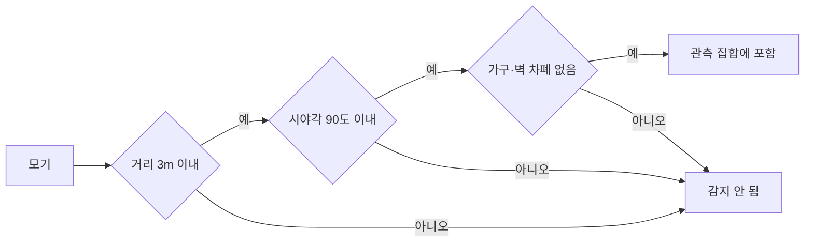
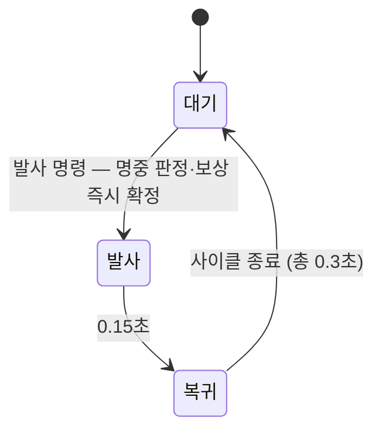
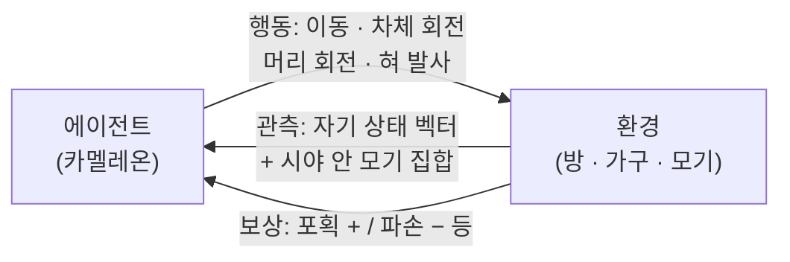
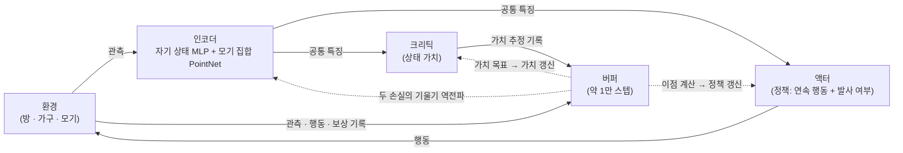
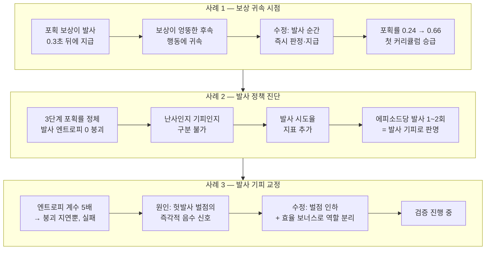

<!-- 🖼️ 표시가 붙은 인용 블록은 PPT 제작용 이미지 제안 메모입니다. 보고서 제출 전 삭제하세요. -->

# Chameleon Agent: 강화학습 기반 실내 모기 포획 로봇 시뮬레이션

## 1. Overview

### 1.1 배경

- 모기로 인한 일상적 불편: 수면 중 소음, 흡혈
- 기존 퇴치 방식의 한계
  - 스프레이·모기향: 화학물질 사용에 따른 부작용
  - 물리적 포획: 자동화 어려움
- 본 프로젝트: Unity 가상환경에서 모기를 자율 포획하는 강화학습 에이전트 개발
- 최종 목표: 가상환경에서 검증한 정책을 실제 로봇 시스템으로 이식

> 🖼️ **PPT 이미지 제안** — 도입 슬라이드: 모기로 인한 불편을 표현한 일러스트 + 혀로 벌레를 잡는 실제 카멜레온 사진. 프로젝트 컨셉이 한눈에 전달됨.

### 1.2 목표

1. 집안의 모든 모기 포획 (최우선 목표)
2. 포획 과정에서 집안 물품 파손 금지
3. 현실과 동일한 물리 조건 전제
   - 실물 로봇 이식 고려
   - 게임적 단순화 배제

## 2. Environment

### 2.1 가상 공간 구조

- 규모: 가로 7m × 세로 7m × 높이 3m 고정 원룸
- 구성: 벽·바닥·천장으로 둘러싸인 밀폐 공간, 가구 고정 배치
- 방 구조는 매 에피소드 동일
- Unity 물리 엔진 기반: 중력·충돌 등 현실과 동일한 물리 적용
- 동일한 방 4개 복제 → 에이전트 4개가 병렬로 경험 수집

> 🖼️ **PPT 이미지 제안** — Unity 씬 스크린샷 2장: ① 방 전체 부감 샷, ② 병렬 영역 4개가 나란히 보이는 샷.

### 2.2 카멜레온 에이전트

- 약 30cm 소형 홈 로봇으로, 바퀴 구동 차체(전·후진, 제자리 회전) 위에 독립적으로 좌우·상하 회전하는 머리를 얹은 구조이며, 매 에피소드 방 중앙에서 시작함
- 카메라와 혀 발사구가 모두 머리에 장착되어 있어, 머리를 돌려 모기를 찾고 조준한 방향으로 발사하는 행동이 구조적으로 요구됨
- 시야는 시야각 약 90도, 유효 거리 약 3m이며, 가구나 벽에 가려진 모기는 감지하지 못함
- 약 5mm 크기의 모기는 영상 인식으로 안정적 검출이 어려우므로, 시야·차폐 판정을 통과한 모기의 상대 위치와 속도를 센서로 직접 수신함
- 공격은 사거리 약 2.5m의 늘어나는 혀로 수행하며, 발사·복귀 사이클 0.3초가 곧 쿨다운이고 혀 끝 흡착력으로 대상을 부착해 끌어옴

> 🖼️ **PPT 이미지 제안** — 에이전트 클로즈업 스크린샷에 부위 라벨(바퀴·몸통·머리·발사구) + 혀 발사 순간 인게임 GIF.

### 2.3 가구

- 고정된 수·위치로 배치, 가구별 현실적 무게와 파손 임계값 부여
- 혀 흡착 시 결과는 물리 엔진과 무게가 자동 결정
  - 모기 (거의 무중력): 즉시 빨려옴 → 포획
  - 가벼운 물체 (식기·책 등): 끌려오다 바닥에 떨어지며 충돌
  - 무거운 가구 (책상·냉장고 등): 움직이지 않음
- 충돌 충격이 파손 임계값 초과 시 파손 → 에피소드 즉시 실패 종료

### 2.4 모기

- 에피소드당 3~10마리 무작위 생성, 초기 위치는 방 안 임의 공중
- 행동 패턴: 무작위 비행 ↔ 벽·천장·가구 착지 반복
- 카멜레온을 인식하지 않음 (회피 행동 없음), 개체 간 상호작용 없음
- 현실 모기 수준의 특성: 크기 약 5mm, 비행 속도 약 초속 1m

## 3. MDP

- 모기 포획 문제를 마르코프 결정 과정으로 정의
- 상태 전이: Unity 물리 엔진이 담당 (에이전트는 전이 모델을 모르는 채 경험으로 학습)
- 시야·차폐 제약으로 부분 관측만 수신 → 엄밀하게는 부분 관측 마르코프 결정 과정

### 3.1 관측 공간

**자기 상태 벡터 (10차원)**

| 항목 | 차원 | 설명 |
|------|------|------|
| 위치 | 2 | 시작 지점 기준 상대 좌표 (바닥 주행이므로 높이 생략) |
| 속도 | 2 | 차체 방향 기준 좌표계 |
| 머리 각도 | 2 | 상하·좌우 조준 각도 |
| 남은 모기 수 | 1 | 방 전체 잔여 수 (시야와 무관) |
| 혀 준비 상태 | 1 | 발사 가능 1, 사이클 진행 중 0 |
| 무실수 여부 | 1 | 헛발사가 한 번도 없으면 1 |
| 최근 발사 횟수 | 1 | 직전 포획 이후 발사 횟수 (3회에서 포화) |

- 뒤의 세 항목은 보상 구조를 가치 함수가 예측 가능하게 만들기 위한 관측
  - 예: 혀 사이클 중 발사 입력이 무시되는 사실을 모르면, 같은 행동이 다른 결과를 내는 것처럼 보여 학습 방해
- 차체의 절대 방향은 관측에서 제외
  - 모기 위치가 머리 기준 상대 좌표 → 조준·접근 정보가 이미 충분
  - 절대 각도 제외 시 같은 상대 상황이 차체 방향과 무관하게 같은 관측 → 일반화 유리

**모기 집합 관측**

- 시야·차폐 판정을 통과한 모기들의 집합 (0~최대 10마리, 매 스텝 가변)
- 모기 한 마리당 6개 값: 머리 기준 상대 위치 3개 + 상대 속도 3개
- 가변 크기 집합은 신경망의 PointNet 인코더가 고정 크기 특징으로 변환

### 3.2 행동 공간

**연속 행동 (4개, 각각 −1 ~ 1)**

| 항목 | 설명 |
|------|------|
| 전진·후진 | 최대 전진 초속 0.5m, 후진 초속 0.3m |
| 차체 회전 | 최대 초당 120도, 제자리 회전 가능 |
| 머리 좌우 회전 | 최대 초당 180도, 좌우 90도 제한 |
| 머리 상하 회전 | 최대 초당 120도, 아래 60도 ~ 위 45도 제한 |

**이산 행동 (1개)**

- 대기 또는 혀 발사 중 선택
- 혀 사이클 진행 중의 발사 선택은 환경이 무시

### 3.3 보상 함수

| 항목 | 조건 | 값 |
|------|------|----|
| 모기 포획 | 혀가 모기에 명중 (마리당) | +1.0 |
| 허공 발사 | 발사했으나 빗나감 | −0.01 |
| 시간 경과 | 매 물리 스텝 | −0.001 |
| 거리 접근 | 시야 안 최근접 모기와의 거리 감소 | 1m당 +0.05 |
| 가구 파손 | 파손 발생 (즉시 실패 종료) | −5.0 |
| 완전 포획 | 방 안 모든 모기 포획 (즉시 성공 종료) | +1.0 |
| 정밀 사격 | 헛발사 없이 완전 포획 달성 시 추가 | +2.0 |
| 효율 사격 | 직전 포획 이후 3발 이내 포획 시 추가 | +0.5 |

- 거리 접근 보상: 희소 보상 완화용 보상 형성 — 초기 학습에서 접근 행동을 먼저 유도
- 포획·허공 발사 판정은 발사 순간 즉시 확정
  - 사이클 종료 시점(0.3초 뒤) 판정 시 보상이 엉뚱한 후속 행동에 귀속 → 인과 학습 실패
- 정밀·효율 보너스: 무분별한 연사 대신 조준 후 발사 유도
  - 사격 경제성을 벌점이 아닌 보너스로 설계 — 실험에서 확인된 발사 기피 현상 때문 (5장 참조)

### 3.4 에피소드 종료 조건

| 조건 | 결과 |
|------|------|
| 모든 모기 포획 | 성공 종료, 완전 포획 보너스 지급 |
| 가구 파손 | 실패 종료, 파손 벌점 부여 |
| 최대 스텝 도달 | 중립 종료 — 마지막 상태의 가치 추정으로 이어서 계산 |

- 할인율 0.995 사용
  - 에피소드가 600~900 결정 스텝 → 통상적인 0.99로는 탐색 구간 보상 신호가 소실

## 4. RL Algorithm

### 4.1 알고리즘 선택

- PPO 채택
  - 근거: 가구 파손 금지 제약 → 탐색이 보수적이고 정책이 급변하지 않는 알고리즘 필요
  - 클리핑된 대리 목적 함수로 업데이트 폭 제한

$$L^{\text{CLIP}}(\theta) = \hat{\mathbb{E}}_t \left[ \min \left( r_t(\theta)\hat{A}_t,\ \text{clip}(r_t(\theta), 1-\epsilon, 1+\epsilon)\hat{A}_t \right) \right]$$

- 이점 추정: GAE 사용
- 학습 루프: 표준 트레이너 대신 PyTorch 직접 구현
  - 근거: 혼합 행동 공간의 분포 설계와 안정화 장치의 완전한 제어

### 4.2 상호작용과 업데이트 구조

- 전체 시스템은 환경, 인코더, 액터, 크리틱, 버퍼 다섯 요소로 구성
- 실선 = 매 스텝 반복되는 상호작용, 점선 = 버퍼가 가득 찼을 때 일어나는 업데이트

- 상호작용 (실선): 환경의 관측을 인코더가 하나의 특징으로 압축 → 액터가 행동 선택 → 환경이 한 스텝 진행 → 그 결과(관측·행동·보상·가치 추정)를 버퍼에 기록
- 업데이트 (점선): 버퍼가 약 1만 스텝 차면 이점을 계산하고, 전체를 3회 순회하며 미니배치 단위로 액터·크리틱·인코더를 함께 갱신 → 버퍼 비우고 수집 재개
  - 이점은 병렬 에이전트별로 독립 계산 (서로 다른 에이전트의 시간 축이 섞이는 오염 방지)
- 구성 요소 세부
  - 인코더: 자기 상태 벡터는 MLP, 모기 집합은 PointNet(모기마다 공유 신경망 적용 후 최댓값 풀링 — 마릿수가 변해도 출력 크기 일정)으로 처리 후 결합
  - 액터: 연속 행동은 정규분포 표본에 쌍곡탄젠트로 범위 제한, 발사 여부는 범주형 분포
  - 버퍼: 범위 제한 전의 원시 행동 값을 저장 → 업데이트 시 역연산 없이 확률을 정확히 재계산 (경계 부근 수치 오차 차단)
- 안정화 장치: 탐색 분포의 표준편차 상한 (노이즈 폭주 방지), 연속·발사 행동의 엔트로피 분리 관리 (연속 쪽이 발사 쪽 탐색 신호를 압도하는 문제 방지)
- 학습 지표는 MLflow로 기록 — 손실·정책 변화량·가치 예측 정확도 외에 발사 엔트로피와 발사 시도율을 추적해 발사 정책 이상(난사·발사 기피)의 조기 경보로 활용 (5장 참조)

### 4.3 커리큘럼 학습

- 처음부터 최종 난이도로 학습 시 성공 경험이 희소 → 학습 불가
- 쉬운 조건에서 접근·조준을 먼저 익히고 단계적으로 난이도 상승

- 승급 기준: 포획률 (에피소드에 생성된 모기 중 잡은 비율)
  - 최근 50개 에피소드 평균 포획률 80% 초과 시 자동 승급
  - 전멸 여부를 기준으로 하지 않는 근거: 전멸 난이도는 모기 수에 대해 거듭제곱으로 증가 → 다마리 단계에서 커리큘럼 영구 정체
- 난이도 변수(모기 수·속도·생성 범위)는 학습 프로세스가 통신 채널로 주입, 환경은 에피소드 시작 시 적용

## 5. Experiment

### 5.1 실험 설정

- 화면 출력 없는 빌드 환경, 시뮬레이션 시간 20배 가속
- 동일한 방 4개에서 에이전트 4개 병렬 경험 수집
- 학습 지표는 MLflow 기록, 보상 수치·하이퍼파라미터는 실험을 거치며 조정 (본문 값은 현재 설정)

### 5.2 학습 경과와 문제 해결 과정

- 학습은 한 번에 완성되지 않음 — 정체 원인 진단과 수정을 반복
- 주요 사례 3가지:

**사례 1 — 보상 귀속 시점 문제**

- 초기 구현: 포획 판정·보상이 혀 사이클 종료 시점(발사 0.3초 뒤)에 지급
- 그 사이 추가 행동이 여러 번 발생 → 보상이 원인 행동("조준하고 발사")이 아닌 후속 행동에 귀속
- 결과: 정책이 접근 보상만 모으고 발사하지 않는 방향으로 수렴
- 수정: 판정·보상을 발사 순간 즉시 확정
- 효과: 1단계 포획률 0.24 → 0.66, 최초의 커리큘럼 승급 발생

**사례 2 — 발사 정책 진단 도구**

- 3단계(움직이는 모기)에서 포획률 0.5 부근 정체 + 발사 엔트로피가 거의 0으로 붕괴
- 정책이 결정론적으로 굳었다는 신호 — 단, "무조건 쏨"인지 "거의 안 쏨"인지 엔트로피만으로 구분 불가
- 수집 데이터에서 발사 시도 비율을 집계하는 지표 추가
- 측정 결과: 에피소드당 발사 1~2회 → 발사 기피 상태로 확정

**사례 3 — 발사 기피와 보상 구조 수정**

- 발사 기피는 자기강화적
  - 발사 안 함 → 포획 경험 없음 → 발사의 이득 학습 불가 → 발사 더 감소
- 시도 1: 발사 행동의 엔트로피 계수 5배 → 붕괴를 약간 늦출 뿐 실패
- 진단: 두 차례 실험의 증거가 헛발사 벌점의 즉각적 음수 신호를 원인으로 지목
- 시도 2: 헛발사 벌점을 시도 비용이 거의 없는 수준으로 인하, 사격 경제성은 효율 보너스(양수)가 전담
  - 시도가 거의 공짜 → 발사 경험 풍부화
  - 적은 발수로 잡을수록 보너스 → 조준의 질은 계속 보상
- 현재 이 구조의 효과를 검증 중

> 🖼️ **PPT 이미지 제안** — MLflow 학습 곡선 캡처: 포획률·에피소드 보상·발사 엔트로피·발사 시도율 4개. 특히 발사 엔트로피와 발사 시도율이 함께 0으로 떨어지는 구간을 강조하면 사례 2의 진단 과정이 설득력 있게 전달됨.

### 5.3 현재 상태

- 커리큘럼 1·2단계 (정지 모기): 각각 10~20회 학습 반복 안에 통과
- 현재 병목: 3단계 (느리게 비행하는 모기)
  - 포획률 0.6대 도달, 승급 기준 0.8을 향해 보상 구조 수정 효과 검증 중
  - 잘 풀리는 에피소드는 보상이 양수 전환 — 시간 벌점을 상쇄할 만큼 빠른 포획 성공

## 6. 시사점

- **보상 설계가 알고리즘보다 지배적**
  - 학습 정체의 원인은 한 번도 알고리즘 버그가 아니었음
  - 보상의 귀속 시점, 시도의 한계비용 구조가 정책의 성격을 결정
  - 같은 목표라도 벌점으로 누르는 설계와 보너스로 당기는 설계는 전혀 다른 학습 동역학 생성
- **보상을 예측하는 데 필요한 정보는 관측에 있어야 함**
  - 혀 준비 상태, 무실수 여부, 최근 발사 횟수는 모두 보상 구조와 함께 추가된 관측
  - 가치 함수가 원리적으로 예측할 수 없는 보상은 학습에 잡음으로 작용함을 실험으로 확인
- **진단 지표가 시행착오 비용을 절감**
  - 발사 엔트로피 + 발사 시도율 두 지표로 "난사 대 발사 기피" 갈림길을 측정으로 확정
  - 지표가 없었다면 반대 방향 처방(벌점 강화)으로 문제를 악화시켰을 것
- **커리큘럼 승급 기준은 난이도 구조를 고려해야 함**
  - 전멸 여부 대신 포획률 채택 → 목표 마리 수 증가 시 요구 실력이 거듭제곱으로 커지는 함정 회피
- **남은 과제**
  - 단기: 3단계 돌파, 상위 단계(빠른 비행·여러 마리) 검증
  - 장기: 학습된 정책의 실물 소형 로봇 이식, 시뮬레이션과 현실의 간극 측정

> 🖼️ **PPT 이미지 제안** — 마무리 슬라이드: 시뮬레이션 스크린샷 → 실물 로봇 컨셉 일러스트로 이어지는 화살표 한 장 (sim-to-real 로드맵).
